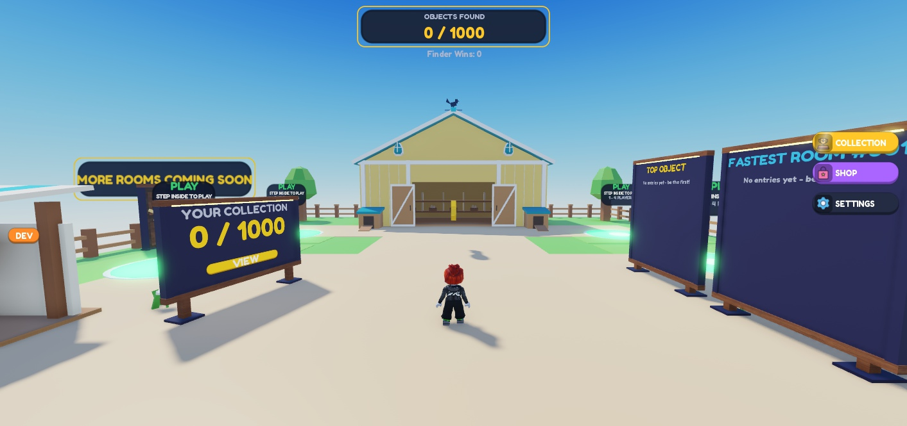
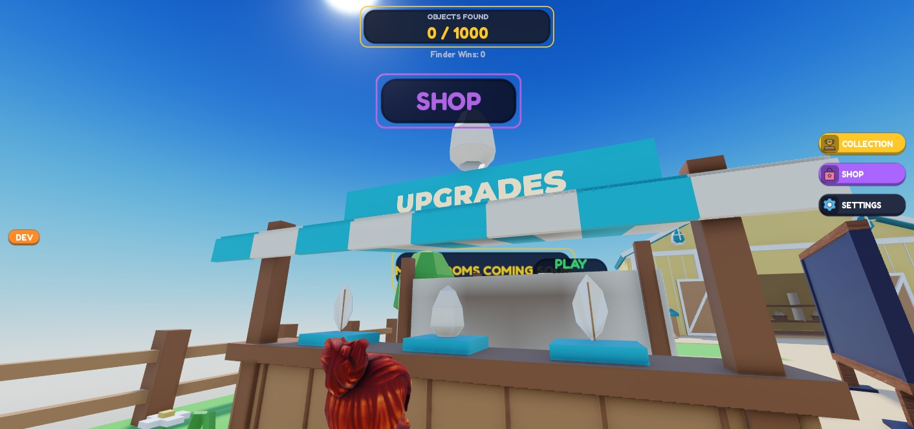
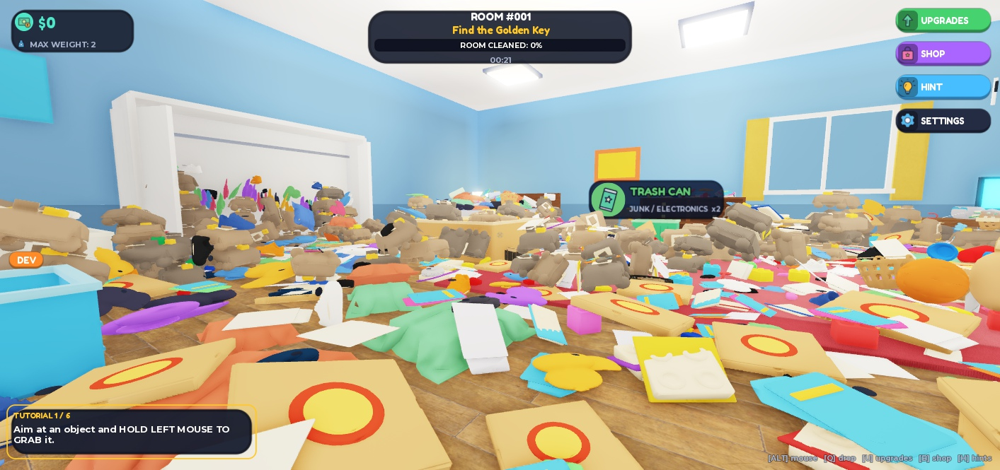
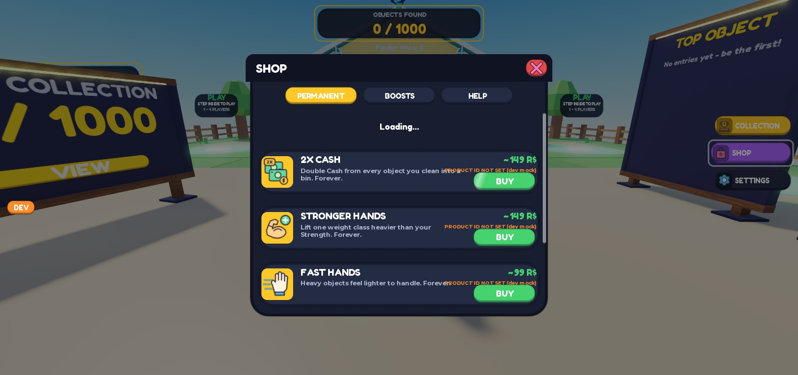
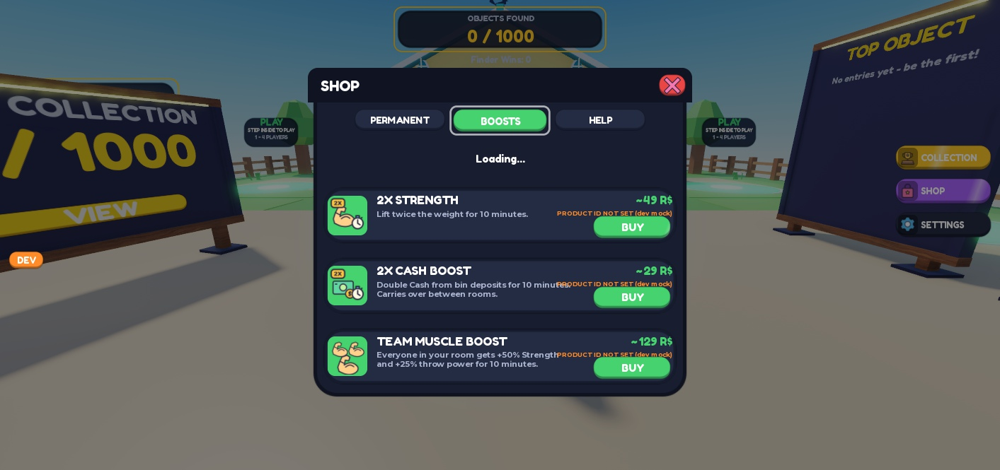
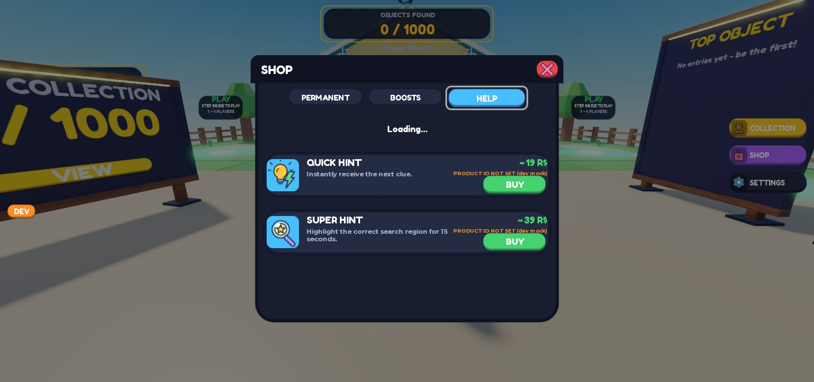
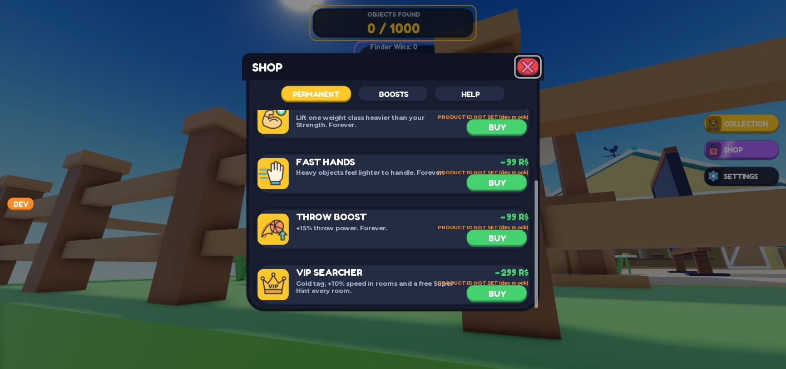
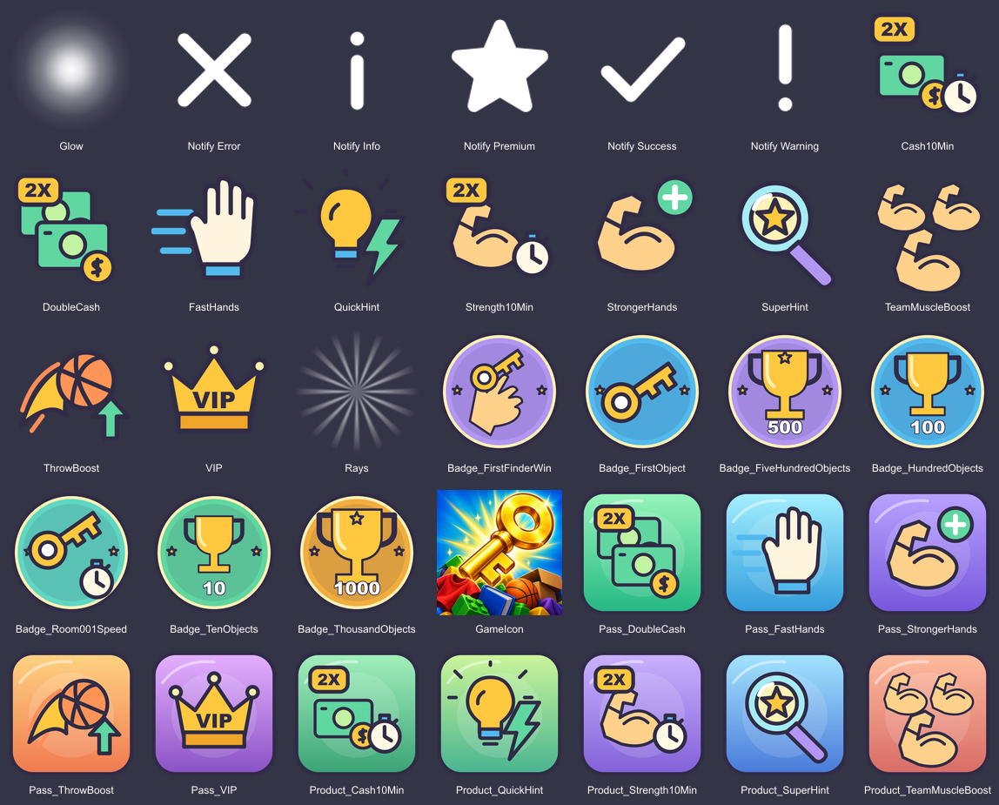

# Additional assets and lobby setup — 14 September 2026

Place: 1000 Hidden Objects, placeId 117675182630398.

Added 19 UI image attributes, 21 Creator Hub PNG files, and six tagged lobby objects. The lobby additions contain 51 BaseParts, all anchored, noncolliding and CanTouch=false. No Studio scripts or UI layouts were created, edited or deleted. Nothing requested was skipped.

## Part A — UI images

Installed at ReplicatedStorage.GameAssets.UIImages as STRING attributes. All original 24 attributes were retained, for 43 total.

| Key | Roblox image |
|---|---|
| Glow | rbxassetid://121196171903265 |
| Rays | rbxassetid://78171063235742 |
| Logo | rbxassetid://95267532898680 |
| LoadingBackground | rbxassetid://73855222508447 |
| Icon_Notify_Info | rbxassetid://127654306838860 |
| Icon_Notify_Success | rbxassetid://115874730968541 |
| Icon_Notify_Warning | rbxassetid://73057523441986 |
| Icon_Notify_Error | rbxassetid://77017657913667 |
| Icon_Notify_Premium | rbxassetid://135890840300694 |
| Icon_Prod_DoubleCash | rbxassetid://129250602561603 |
| Icon_Prod_StrongerHands | rbxassetid://134361076786951 |
| Icon_Prod_FastHands | rbxassetid://73464995716083 |
| Icon_Prod_ThrowBoost | rbxassetid://86960028570573 |
| Icon_Prod_VIP | rbxassetid://104155498878927 |
| Icon_Prod_Strength10Min | rbxassetid://89680190449854 |
| Icon_Prod_Cash10Min | rbxassetid://140325526376696 |
| Icon_Prod_TeamMuscleBoost | rbxassetid://103537113039346 |
| Icon_Prod_QuickHint | rbxassetid://79769020720304 |
| Icon_Prod_SuperHint | rbxassetid://113217719921909 |

Sources and PNGs are in [ui](ui). Dimensions: Glow 256×256; Rays 512×512; Logo 1024×440; LoadingBackground 1920×1080; notification symbols 128×128; product icons 256×256. All have transparency except the opaque LoadingBackground. Glow and Rays are white with alpha falloff; Rays contains 16 rays.

The product set extends the original vector artwork, reusing Icon_Strength, Icon_Cash and Icon_Hint. The two timed 2X boosts use the same badge/clock layout. The bedroom illustration was generated using built-in imagegen. The wordmark uses gold and white outlined lettering with a key worked into a zero.

## Part B — Creator Hub files only

PNG folder: C:/1000 Hidden Objects/output/creator-hub/. No passes, products or badges were created on Roblox.

- [Pass_DoubleCash.png](../../creator-hub/Pass_DoubleCash.png) — 512×512
- [Pass_StrongerHands.png](../../creator-hub/Pass_StrongerHands.png) — 512×512
- [Pass_FastHands.png](../../creator-hub/Pass_FastHands.png) — 512×512
- [Pass_ThrowBoost.png](../../creator-hub/Pass_ThrowBoost.png) — 512×512
- [Pass_VIP.png](../../creator-hub/Pass_VIP.png) — 512×512
- [Product_QuickHint.png](../../creator-hub/Product_QuickHint.png) — 512×512
- [Product_SuperHint.png](../../creator-hub/Product_SuperHint.png) — 512×512
- [Product_Strength10Min.png](../../creator-hub/Product_Strength10Min.png) — 512×512
- [Product_Cash10Min.png](../../creator-hub/Product_Cash10Min.png) — 512×512
- [Product_TeamMuscleBoost.png](../../creator-hub/Product_TeamMuscleBoost.png) — 512×512
- [Badge_FirstObject.png](../../creator-hub/Badge_FirstObject.png) — 512×512
- [Badge_TenObjects.png](../../creator-hub/Badge_TenObjects.png) — 512×512
- [Badge_HundredObjects.png](../../creator-hub/Badge_HundredObjects.png) — 512×512
- [Badge_FiveHundredObjects.png](../../creator-hub/Badge_FiveHundredObjects.png) — 512×512
- [Badge_ThousandObjects.png](../../creator-hub/Badge_ThousandObjects.png) — 512×512
- [Badge_FirstFinderWin.png](../../creator-hub/Badge_FirstFinderWin.png) — 512×512
- [Badge_Room001Speed.png](../../creator-hub/Badge_Room001Speed.png) — 512×512
- [GameIcon.png](../../creator-hub/GameIcon.png) — 512×512
- [Thumbnail_1.png](../../creator-hub/Thumbnail_1.png) — 1920×1080
- [Thumbnail_2.png](../../creator-hub/Thumbnail_2.png) — 1920×1080
- [Thumbnail_3.png](../../creator-hub/Thumbnail_3.png) — 1920×1080

Pass and product artwork matches the UI icons on bright rounded backgrounds. Badge files have circular designs with transparent corners. GameIcon and the three thumbnails use built-in imagegen artwork. SVG sources for the vector assets are retained alongside their PNGs. Generation descriptions are in [image-prompts.md](image-prompts.md).

## Part C — tagged objects

| Full path | Tag | Attributes / details |
|---|---|---|
| Workspace.Lobby.CollectionBoard | CollectionBoard | Face="Front"; 14×8×0.5; faces spawn |
| Workspace.Lobby.TopFindersBoard | Leaderboard | Kind="TopFinders"; Face="Front"; 12×14×0.5 |
| Workspace.Lobby.FastestBoard | Leaderboard | Kind="Fastest"; Face="Front"; 12×14×0.5; beside TopFinders |
| Workspace.Lobby.UpgradeShop.AwningValance | ShopStand | Existing front awning part at (-44.5, -12.05, 52); other same-named awning pieces are untagged |
| Workspace.Lobby.FutureDoor | FutureDoor | Label="MORE ROOMS COMING SOON"; closed 8×12×0.6 door near queue circles |
| Workspace.Lobby.LobbyKeyDeco | LobbyKeyDeco | 3× copy of GoldenKey; 6.9×3.6×0.9; centre at (0, -13.13, 5), about 8 studs above ground |

Supporting geometry is under Workspace.Lobby.BoardFrames and Workspace.Lobby.FutureDoorFrame. Boards have dark trim, wood supports, and soft warm light rails. The original GoldenKey remains unchanged. The shop tag was first tested on the countertop, then moved to the front awning to keep SHOP above the roof.

## Studio MCP verification

- Play restarted after adding images.
- Collection count and collection button appeared.
- Both leaderboards displayed their titles and “No entries yet - be the first!”.
- SHOP sign and an enabled Open Shop prompt appeared. Pressing E from 7.27 studs away opened the actual shop.
- FutureDoor sign appeared.
- LobbyKeyDeco pivot changed across a 0.7-second observation; spin and bob active.
- All ten product icons were visually checked in the Permanent, Boosts and Help tabs.
- Glow loaded in visible UI. Logo and LoadingBackground both reported IsLoaded=true during the room transition.
- Notification icons and Rays were authored and uploaded; their individual notification/reveal flows were not triggered.
- Client DevCommand StartRoom(1,1) reached MatchState.State="Searching".
- Room #001 validation passed in both runs: 36/36 exposable sockets, 12 regions, 5 bins, 1,816 movable objects, 246 junk chunks, 17 treasures, 3,178 real objects and 5,762 room parts.
- Play stopped.

### Remaining presentation limitation

The existing controller uses fixed font sizes. At the requested board dimensions, TOP OBJECT FINDERS wraps/clips to “TOP OBJECT”, and VIEW COLLECTION clips to “VIEW”. The collection count also reports TextFits=false because its 100px font is in a 96px-high region. The board parts, tags and attributes are correct. Scripts and GUI layout were left unchanged as requested; this needs a later controller text-sizing adjustment.

The shop also displays its existing “PRODUCT ID NOT SET (dev mock)” labels. Creator Hub products were intentionally not created.

### Output errors and test diagnostics

- Existing StudioAccessToApisNotAllowed errors for PlayerData_v1 and TopObjectFinders_v1; profile load 502/error 7; memory fallback remains active.
- A direct MCP require(...ShopController).Open() test failed with a nil menu at ShopController:148. No script was modified; testing continued successfully through real UI clicks and the E prompt.
- MCP virtual mouse movement emitted “hits CoreGUI” diagnostics. Subsequent menu interaction succeeded.
- A string-only ContentProvider preload probe reported Failure even for previously installed images that visibly rendered. It was not used as the final delivery verdict; visible image instances and screenshots confirmed the checks above.
- The local SVG renderer printed font-cache directory warnings, but generated every file successfully; dimensions and visual outputs were checked.
- No missing-model or asset-validation warnings appeared in the final room validation.

Raw Output: [final-output.txt](final-output.txt).

## Preservation and saving

Before/after inspection found unchanged script source fingerprints, unchanged original lobby part transforms/sizes/colors/materials, and unchanged GoldenKey, ClutterAssets, Props, GameSounds and LobbyBackup fingerprints. The final addition audit found no scripts, ScreenGuis or invalid part flags. Git source was not modified; new files are under output/creator-hub and output/game-art/additions.

Final Ctrl+S save confirmed by Studio Output at 01:01:49: Saved new changes in 1000 Hidden Objects to Roblox. These Studio additions live in the place file, not in the Rojo source tree. Use Ctrl+S after any further edits.

## Screenshots

