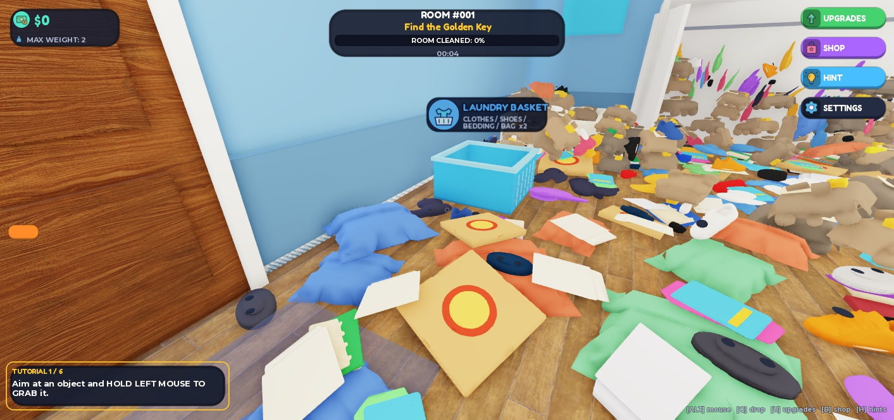

# 1000 Hidden Objects — asset delivery

Place ID: 117675182630398. All requested asset keys are installed. No game scripts were created, edited, or deleted. Workspace.Lobby, ServerStorage.LobbyBackup, the Rojo-managed trees, and GoldenKey were left untouched.

## Slot 3: UI images — completed first

24 string attributes in ReplicatedStorage.GameAssets.UIImages. Five white 256×256 frames, eighteen 256×256 color icons, and one white 64×64 crosshair. Icons were drawn as vector artwork and rasterized to transparent PNG; source SVGs and PNGs are in the ui folder. No ScreenGui or UI layout was added.
Frames use a flat central area for the existing 64-pixel nine-slice margins.

Keys: BarFill, BarTrack, Bin_Books, Bin_Donation, Bin_Laundry, Bin_Toys, Bin_Trash, Button, ButtonRound, Crosshair, Icon_Cash, Icon_Close, Icon_Collection, Icon_Hint, Icon_Key, Icon_MoveSpeed, Icon_Settings, Icon_Shop, Icon_Streak, Icon_Strength, Icon_ThrowPower, Icon_Upgrades, Icon_Weight, Panel.

Skipped: none. Parts: 0.
The UI-only Play test reached Searching and returned RESULT: PASS. HUD and bin-label artwork was visibly loaded.

## Slot 2: bins and boxes

Eight hollow prop shells in ServerStorage.Props, 136 BaseParts total. Bright rims, basket ribs, cart wheels, crate bracing, toy-star and DONATE decals. No scripts, lights, emitters, or sounds inside these models.

| Key | Parts | Size X × Y × Z |
|---|---:|---|
| Bin_Books | 15 | 5.10 × 2.65 × 5.10 |
| Bin_Donation | 17 | 7.40 × 1.65 × 5.90 |
| Bin_Laundry | 23 | 5.50 × 2.85 × 5.50 |
| Bin_Toys | 9 | 5.50 × 2.85 × 5.50 |
| Bin_Trash | 19 | 5.10 × 3.05 × 5.10 |
| Container_Hamper | 23 | 11.40 × 3.40 × 9.40 |
| Container_MovingBox | 12 | 9.40 × 3.60 × 9.40 |
| Container_ToyChest | 18 | 12.40 × 3.20 × 9.40 |

Skipped: none.
The props Play test reached Searching and returned RESULT: PASS.

## Slot 1: clutter

42 models in ServerStorage.ClutterAssets; 76 MeshParts total. Each model contains one to three published MeshParts. Main surfaces are light gray and Tintable=true; added accents are Tintable=false. HeavyBox and the four treasures are not tinted. Every part is anchored, noncolliding, and non-touching in storage. All model pivots are centered and bounds normalized to the supplied dimensions.

The final models use published generated meshes, with reusable published cube/sphere meshes for some small accents. Several generated parts were renamed after visual inspection. Variants reuse source meshes: Hoodie/Shirt, Book_A/B/C and Notebook, CardboardBox_A/B, JunkChunk_A/B/C.

| Key | MeshParts | Size X × Y × Z |
|---|---:|---|
| Backpack_A | 1 | 1.80 × 2.20 × 1.25 |
| Basket_A | 1 | 2.60 × 1.80 × 2.00 |
| Basketball_A | 1 | 2.00 × 2.00 × 2.00 |
| Blanket_A | 1 | 3.40 × 0.70 × 2.80 |
| Book_A | 2 | 1.60 × 0.40 × 1.20 |
| Book_B | 2 | 2.00 × 0.50 × 1.40 |
| Book_C | 2 | 1.50 × 0.60 × 1.90 |
| Bottle_A | 1 | 1.60 × 0.55 × 0.55 |
| Cable_A | 1 | 2.40 × 0.20 × 0.20 |
| Camera_A | 3 | 1.30 × 0.80 × 1.05 |
| Can_A | 1 | 0.90 × 0.50 × 0.50 |
| CardboardBox_A | 2 | 2.00 × 1.60 × 2.00 |
| CardboardBox_B | 2 | 2.60 × 2.25 × 2.60 |
| Controller_A | 3 | 1.65 × 0.30 × 1.00 |
| Cup_A | 1 | 0.90 × 0.70 × 0.70 |
| Headphones_A | 1 | 1.95 × 0.90 × 0.80 |
| HeavyBox_A | 1 | 3.00 × 2.65 × 3.00 |
| Hoodie_A | 2 | 2.60 × 0.60 × 2.20 |
| JunkChunk_A | 3 | 2.65 × 1.60 × 2.40 |
| JunkChunk_B | 3 | 3.00 × 1.80 × 2.60 |
| JunkChunk_C | 3 | 3.40 × 2.00 × 3.00 |
| Laptop_A | 3 | 2.20 × 1.40 × 1.70 |
| Magazine_A | 3 | 1.60 × 0.20 × 2.10 |
| Notebook_A | 2 | 1.20 × 0.20 × 1.60 |
| Paper_A | 1 | 1.40 × 0.15 × 1.90 |
| Pencil_A | 1 | 1.30 × 0.20 × 0.20 |
| Pillow_A | 1 | 2.80 × 0.90 × 1.90 |
| PizzaBox_A | 3 | 2.60 × 0.30 × 2.60 |
| Plush_A | 3 | 1.40 × 1.40 × 1.40 |
| Remote_A | 3 | 0.50 × 0.25 × 1.60 |
| Shirt_A | 2 | 2.20 × 0.35 × 1.80 |
| Shoe_A | 3 | 1.90 × 0.95 × 0.80 |
| Sock_A | 1 | 1.10 × 0.45 × 0.45 |
| StorageBin_A | 1 | 3.10 × 2.15 × 2.30 |
| TeddyBear_A | 3 | 1.60 × 2.55 × 1.60 |
| ToyBlock_A | 1 | 1.00 × 1.00 × 1.00 |
| ToyCar_A | 1 | 1.70 × 0.85 × 0.90 |
| ToyDuck_A | 3 | 1.10 × 1.45 × 1.40 |
| Treasure_Coin | 1 | 0.20 × 1.00 × 1.00 |
| Treasure_Phone | 1 | 0.70 × 0.14 × 1.40 |
| Treasure_Trophy | 1 | 0.80 × 1.85 × 1.20 |
| Treasure_Watch | 1 | 0.30 × 0.90 × 2.10 |

Skipped: none.
Earlier local CSG mesh attempts rendered as boxes when cloned. They were replaced; the final inventory has no empty MeshIds. Final QA found no prohibited descendants or part-count violations.

## Slot 4: sounds

32 Sound entries in SoundService.GameSounds: 30 effects plus two looped music tracks. All 32 loaded in the Client datamodel. Effects use volumes 0.3–0.65; both music tracks use 0.25. Related effects reuse clips with different playback speeds. Creator Store sources are ProSoundEffects and APMOfficial; these are Roblox-use library assets, not a claim of unrestricted redistribution rights.

| Key | Asset | Volume | Speed | Looped | Source |
|---|---|---:|---:|---|---|
| BinHover | [9126113537](https://create.roblox.com/store/asset/9126113537) | 0.30 | 1.80 | No | ProSoundEffects |
| CashAward | [9113849492](https://create.roblox.com/store/asset/9113849492) | 0.40 | 1.40 | No | ProSoundEffects |
| ChunkBurst | [9117233449](https://create.roblox.com/store/asset/9117233449) | 0.45 | 0.80 | No | ProSoundEffects |
| Countdown | [9126113537](https://create.roblox.com/store/asset/9126113537) | 0.40 | 1.05 | No | ProSoundEffects |
| Deposit | [9113818802](https://create.roblox.com/store/asset/9113818802) | 0.40 | 1.10 | No | ProSoundEffects |
| DepositMatch | [9113818802](https://create.roblox.com/store/asset/9113818802) | 0.50 | 1.35 | No | ProSoundEffects |
| Grab | [9113819689](https://create.roblox.com/store/asset/9113819689) | 0.35 | 1.50 | No | ProSoundEffects |
| Hint | [9116394545](https://create.roblox.com/store/asset/9116394545) | 0.40 | 1.10 | No | ProSoundEffects |
| HotColdPing | [9126073001](https://create.roblox.com/store/asset/9126073001) | 0.30 | 1.50 | No | ProSoundEffects |
| KeyRattle | [9113849492](https://create.roblox.com/store/asset/9113849492) | 0.50 | 1.00 | No | ProSoundEffects |
| Land | [9120888980](https://create.roblox.com/store/asset/9120888980) | 0.40 | 1.00 | No | ProSoundEffects |
| LandHard | [9120888980](https://create.roblox.com/store/asset/9120888980) | 0.45 | 0.85 | No | ProSoundEffects |
| LandPaper | [9117233449](https://create.roblox.com/store/asset/9117233449) | 0.30 | 1.40 | No | ProSoundEffects |
| LandSoft | [9113819689](https://create.roblox.com/store/asset/9113819689) | 0.30 | 1.00 | No | ProSoundEffects |
| LobbyAmbience | [9043323476](https://create.roblox.com/store/asset/9043323476) | 0.25 | 1.00 | Yes | APMOfficial |
| Notification | [9126073001](https://create.roblox.com/store/asset/9126073001) | 0.45 | 1.00 | No | ProSoundEffects |
| QueueEnter | [9126073001](https://create.roblox.com/store/asset/9126073001) | 0.40 | 1.20 | No | ProSoundEffects |
| QueueLeave | [9126073001](https://create.roblox.com/store/asset/9126073001) | 0.30 | 0.75 | No | ProSoundEffects |
| RoomAmbience | [9043326195](https://create.roblox.com/store/asset/9043326195) | 0.25 | 1.00 | Yes | APMOfficial |
| Streak | [9126073318](https://create.roblox.com/store/asset/9126073318) | 0.50 | 1.40 | No | ProSoundEffects |
| Swish | [9120709477](https://create.roblox.com/store/asset/9120709477) | 0.40 | 1.80 | No | ProSoundEffects |
| TargetFound | [9116395089](https://create.roblox.com/store/asset/9116395089) | 0.65 | 1.20 | No | ProSoundEffects |
| TargetReveal | [9116394545](https://create.roblox.com/store/asset/9116394545) | 0.55 | 1.00 | No | ProSoundEffects |
| TeleportWhoosh | [9120709477](https://create.roblox.com/store/asset/9120709477) | 0.55 | 0.90 | No | ProSoundEffects |
| Throw | [9120709477](https://create.roblox.com/store/asset/9120709477) | 0.40 | 1.50 | No | ProSoundEffects |
| TooHeavy | [9126113143](https://create.roblox.com/store/asset/9126113143) | 0.35 | 0.55 | No | ProSoundEffects |
| Treasure | [9116395089](https://create.roblox.com/store/asset/9116395089) | 0.50 | 1.10 | No | ProSoundEffects |
| UIClick | [9126113537](https://create.roblox.com/store/asset/9126113537) | 0.35 | 1.50 | No | ProSoundEffects |
| UIClose | [9126113537](https://create.roblox.com/store/asset/9126113537) | 0.30 | 0.85 | No | ProSoundEffects |
| UpgradeDenied | [9126113143](https://create.roblox.com/store/asset/9126113143) | 0.40 | 0.65 | No | ProSoundEffects |
| UpgradePurchase | [9126073318](https://create.roblox.com/store/asset/9126073318) | 0.50 | 1.15 | No | ProSoundEffects |
| VictorySting | [1841391669](https://create.roblox.com/store/asset/1841391669) | 0.60 | 1.00 | No | APMOfficial |

Skipped: none. Parts: 0.

## Slot 5: Golden Key

Existing ServerStorage.Targets.GoldenKey preserved without changes.

## Final Studio MCP test

- Restarted Play and fired DevCommand StartRoom(1,1) from the Client.
- Reached MatchState.State = Searching.
- RESULT: PASS — 36/36 exposable sockets, 12 regions, five bins.
- Final room: 1,816 physics bodies, 246 junk chunks, 17 treasures; 3,178 real objects including chunk contents.
- All 32 sound entries loaded successfully.
- No asset-related errors appeared in the final Output.
- Existing Output errors: StudioAccessToApisNotAllowed for PlayerData_v1 and TopObjectFinders_v1; profile load rejected (502/error 7), with memory fallbacks.
- Play stopped. Temporary generated models removed; Workspace contains Terrain, Lobby, Camera.

The task also includes inline screenshots from the UI-only, props, and clutter Play tests.
The full asset IDs and flags are in asset-manifest.json. Raw final Output is in final-output.txt.

## Saving

Final Ctrl+S save confirmed by Studio Output at 23:49:50: Saved new changes in 1000 Hidden Objects to Roblox. These asset slots live in the place file, not the Rojo source tree. Use Ctrl+S again after any further edits.
